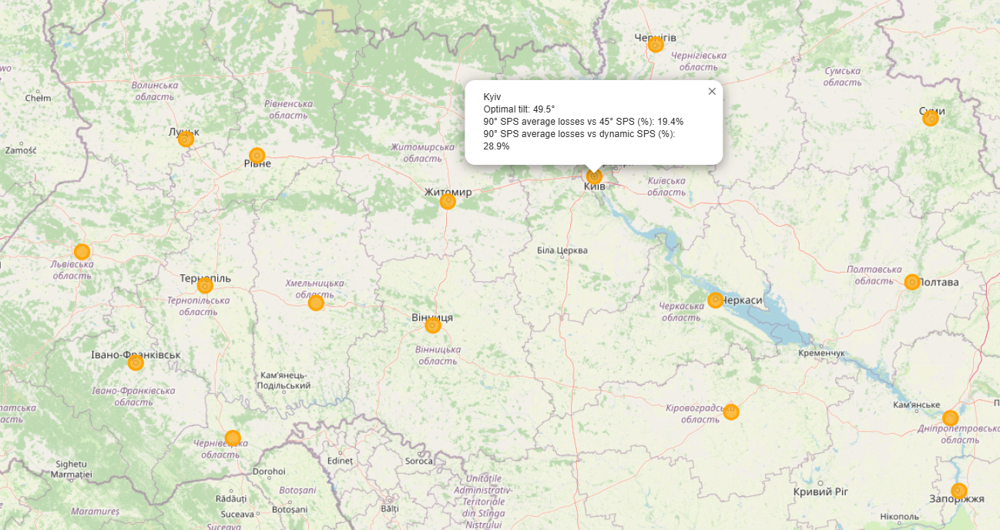

# SPS-Vertical-vs-Traditional

This project analyzes the efficiency of **vertical solar panels (90°)** compared to **traditional fixed-tilt panels (45°)** and **dynamic panels (daily optimal tilt)**.  
The study is based on real production data from a **10 kW vertical system in Kyiv (Ukraine)** and extended to an **analytical framework for optimal tilt strategies**.

---

## 📌 Project Goals
- Compare **real** vs. **theoretical** electricity production of vertical panels.
- Assess **seasonal performance differences** (winter vs. summer).
- Calculate **optimal tilt angles** for Kyiv and other regions of Ukraine.
- Create **interactive map** with regional recommendations for Ukraine.
- Estimate **losses** of vertical panels compared to traditional and dynamic panels.
- Create **interactive map** with regional recommendations for the world.

---

## 🛠️ Tech Stack
- **Python**: pandas, numpy, matplotlib, pvlib, folium  
- **Data**: real production dataset (10 kW vertical SPS, Kyiv)  
- **Visualization**: line charts, comparative plots, interactive maps  

---

## 📊 Key Insights (Short Version)
1. **45° tilt** – the best **annual compromise**, giving stable and maximal yearly output.  
2. **Vertical panels (90°)** – excellent in **winter months**, but weaker in summer; practical for façades and balconies.  
3. **83° tilt** – boosts winter production, though harder to maintain.  
4. **Seasonal adjustment** (25° in April-September, 75° in Oktober-March) – gives **maximum efficiency**, but requires manual changes.  

👉 Detailed reasoning and extended analysis: [CONCLUSIONS.md](/CONCLUSIONS.md)

---

## 🌍 Interactive Maps
The project includes **folium-based maps** to explore optimal tilt recommendations across regions.

You can view the interactive Solar Tilt Map of Ukraine here:  
[🔗 Open Map](https://jpohrebitska-dataanalyst.github.io/SPS-Vertical-vs-Traditional/solar_tilt_ukraine_map.html)

Screenshots:  
  

---

## 📂 Repository Structure
- **data/** → input dataset (Excel)  
- **notebooks/** → Jupyter notebooks for calculations and plots  
- **results/** → maps and images
- **CONCLUSIONS.md** → project conclusions  
- **README.md** → project documentation  
- **requirements.txt** → dependencies  

---

## ✅ Summary
- **45°** → stable, best for annual total generation.  
- **90°** → strong **winter performance** and easy to maintain.  
- **83°** → compromise for winter-oriented users, harder to maintain.  
- **Seasonal tilt** → maximum yield, but less practical.  

---
